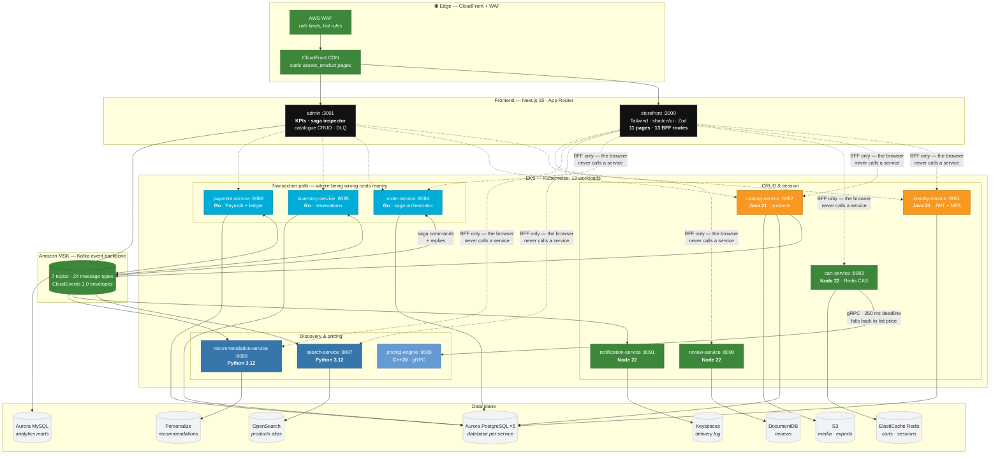
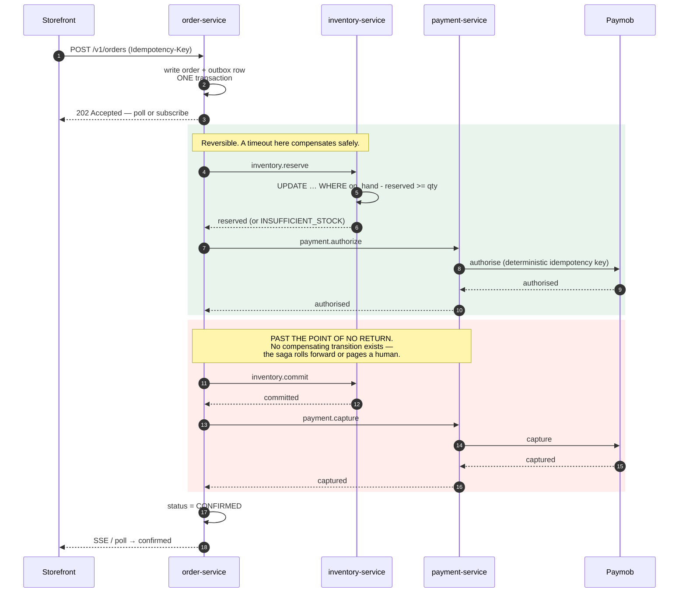
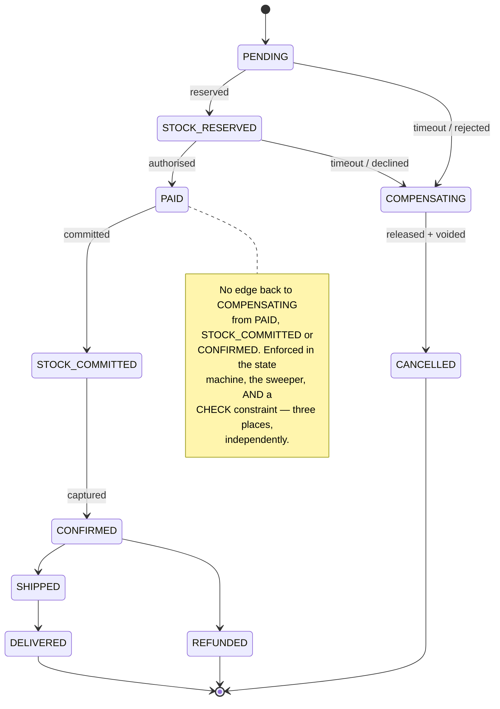
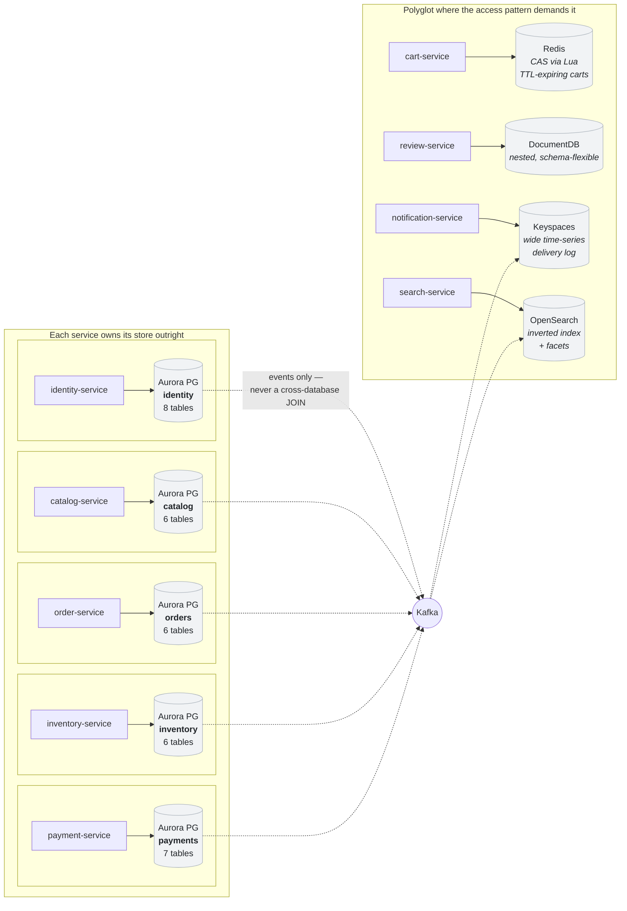
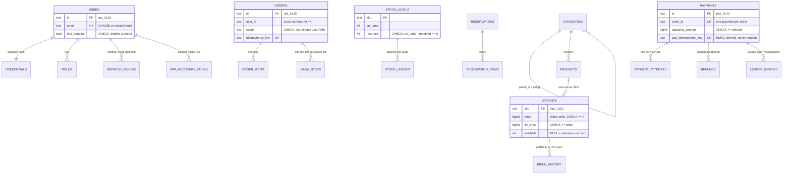
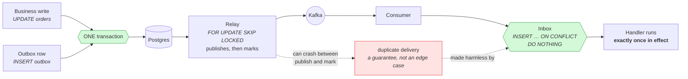

# SOUQ — E-Commerce Microservices on AWS

A distributed commerce platform. **Eleven backend services across five languages**, two Next.js
frontends, an event backbone, and a checkout flow whose correctness was established by exhaustive
state-space search *before* any of it was written.

**417 files · ~63,800 lines · 275 automated assertions passing · all 13 container images build.**

```bash
make check    # the whole gate: models → contracts → tests → lint → frontend → images → k8s
```

---

## Contents

- [The part that matters](#the-part-that-matters)
- [System architecture](#system-architecture)
- [Checkout: the distributed transaction](#checkout-the-distributed-transaction)
- [Database architecture](#database-architecture)
- [Entity relationships](#entity-relationships)
- [Event flow](#event-flow)
- [Verified, not asserted](#verified-not-asserted)
- [Quick start](#quick-start)
- [Why each service is in the language it is in](#why-each-service-is-in-the-language-it-is-in)
- [Failure-aware by construction](#failure-aware-by-construction)
- [Repository layout](#repository-layout)

---

## The part that matters

Checkout is a distributed transaction across three independent databases with no two-phase commit.
It is not obviously correct, so it was **modelled and model-checked before it was implemented**.

Four exhaustive state-space models in [`libs/go-modelcheck`](libs/go-modelcheck/) cover the places
where a wrong interleaving costs money. **Five design decisions in this repository exist because a
model produced a counterexample** — written up in
[`docs/DESIGN-INVARIANTS.md`](docs/DESIGN-INVARIANTS.md), each with a config that still reproduces
the original bug.

The most consequential:

> **You must not compensate after the point of no return.**
>
> The natural implementation gives every non-terminal saga state a rollback timeout. The explorer
> finds the trace in nine steps: inventory commits, the acknowledgement is delayed behind a
> consumer rebalance, the saga times out and voids the payment — and you end with stock deducted
> and nothing charged for it.
>
> So `PAID` and `STOCK_COMMITTED` have **no compensating transition**. They retry forward or page a
> human. That rule is enforced in three independent places: the
> [state machine](services/order-service/internal/saga/machine.go), the
> [sweeper](services/order-service/internal/orchestrator/sweeper.go), and a
> [CHECK constraint](services/order-service/migrations/0001_init.sql).

```bash
make models
```

Several of these tests assert that a **known-bad design still fails**. If one ever passes, an
invariant has been silently weakened and the build breaks — which is the point.

---

## System architecture



**The dashed lines are the boundary that matters.** The browser never calls a service directly
([`docs/CONTRACTS.md`](docs/CONTRACTS.md) §8). Every request goes through a Route Handler in the
Next.js app, which fans out and **validates every response with a Zod schema before a component
sees it**. That buys three things: tokens stay out of JavaScript, a service that starts returning
`available: null` produces one clean 502 with a request id, and eleven services in five languages
become one origin with no CORS surface.

---

## Checkout: the distributed transaction

`POST /v1/orders` returns **202**, not 201. The saga has started; it has not finished.



Everything in the green band is reversible: a timeout releases the reservation and voids the
authorisation. Everything in the red band is not, and
[`DESIGN-INVARIANTS.md`](docs/DESIGN-INVARIANTS.md) §1 is the proof that treating it as reversible
loses money.

### The saga state machine



---

## Database architecture

**Database per service, not schema per service.** Five separate Aurora clusters. A shared cluster
means a runaway query in review moderation degrades checkout, and it means the boundary is a
convention that one `JOIN` at 2am erases.



| Store | AWS service | Owner | Why this store |
|---|---|---|---|
| PostgreSQL `identity` | Aurora Serverless v2 | identity | Transactional, low volume, spiky. Serverless suits a login curve |
| PostgreSQL `catalog` | Aurora PostgreSQL | catalog | Relational with JSONB attributes; GIN indexes for the category tree |
| PostgreSQL `orders` | Aurora PostgreSQL | order | The saga needs single-row ACID and a `CHECK` that outlives the code |
| PostgreSQL `inventory` | Aurora PostgreSQL | inventory | One conditional `UPDATE` in one row latch is the oversell guarantee |
| PostgreSQL `payments` | Aurora PostgreSQL | payment | Double-entry ledger. Finance reconciles against it |
| MySQL `analytics_ops` | Aurora MySQL | admin/BI | Denormalised marts; separate so a report cannot slow a checkout |
| MongoDB `reviews` | DocumentDB | review | Nested, schema-flexible documents with per-product aggregates |
| Cassandra `notifications` | Keyspaces | notification | Wide, append-only time series. Wrong shape for a relational store |
| Redis | ElastiCache | cart / pricing | Carts expire. A TTL and a compare-and-set are the whole access pattern |
| OpenSearch | OpenSearch Service | search | An inverted index and facets are not something SQL does well |

---

## Entity relationships

Relationships **within** a service are foreign keys. Relationships **across** services are ids with
no constraint behind them — because there cannot be one, and pretending otherwise is how a
distributed system acquires a hidden monolith.



**The three constraints worth reading twice**, each verified against real Postgres by
`make sql-check`:

```sql
-- inventory: the oversell guarantee. One statement, one row latch.
UPDATE stock_levels SET reserved = reserved + $2
 WHERE sku = $1 AND status = 'ACTIVE' AND on_hand - reserved >= $2;

-- catalog: a "was 999, now 1299" strikethrough is a regulator's problem
-- in most markets. The schema makes it unrepresentable.
CHECK (list_price IS NULL OR list_price >= price)

-- orders: the point of no return, restated where no code path can bypass it.
CHECK (status NOT IN ('PAID','STOCK_COMMITTED','CONFIRMED') OR compensated_at IS NULL)
```

> **50 concurrent Postgres connections racing 10 units at 2 each → exactly 5 winners,
> `reserved == 10`**, and the `no_oversell` CHECK rejected a direct `UPDATE` issued outside the
> application. Not asserted — executed, by `make sql-check`.

---

## Event flow

Every service writes events through a **transactional outbox**, and each of the three parts is
individually load-bearing —
[`outbox_model_test.go`](services/order-service/internal/eventbus/outbox_model_test.go) shows what
breaks when any one is removed.



| Topic | Partitions | Key | Retention | Produced by |
|---|---|---|---|---|
| `souq.order.events.v1` | 12 | `orderId` | 7d | order |
| `souq.inventory.events.v1` | 12 | `sku` | 7d | inventory |
| `souq.payment.events.v1` | 6 | `orderId` | 30d | payment |
| `souq.catalog.events.v1` | 6 | `productId` | ∞ **compacted** | catalog |
| `souq.notification.commands.v1` | 6 | `userId` | 7d | order / payment / identity |
| `souq.activity.v1` | 12 | `sessionId` | 30d | storefront |
| `souq.dlq.v1` | 3 | original key | 30d | every consumer |

The catalogue topic is **compacted**, and that single fact shapes its payloads: Kafka keeps only
the newest message per key, so every product event carries **full current state, not a delta** — a
consumer rebuilding its index sees exactly one message per product. A delete emits a real Kafka
tombstone (a genuinely null payload) so the key eventually leaves the topic entirely.

---

## Verified, not asserted

Everything below was executed in this repository. The command is given so you can re-run it.

| Check | Result | Command |
|---|---|---|
| Saga state machine: exhaustive reachability, idempotency of every transition, no-rollback-past-commit | ✅ | `make models` |
| **50 concurrent buyers, 2 units each, 10 in stock → exactly 5 winners** | ✅ | `make sql-check` |
| 66 schema invariants against real Postgres — every one a write that must be rejected | ✅ | `make sql-check` |
| **Paymob**: 40 assertions — 7 forged-callback variants rejected, duplicate order does not double-charge, transport failure maps to UNKNOWN | ✅ | `cd services/payment-service && go test ./internal/psp/` |
| Payment idempotency: 11 assertions on the deterministic provider-key derivation | ✅ | `go test ./internal/payment/` |
| C++ pricing engine: 55 assertions, clean under `-Wall -Wextra -Wpedantic -Werror` | ✅ | `cd services/pricing-engine && ./build/rules_test` |
| Zod contracts: 29 tests, including one that parses `machine.go` and asserts the Go and TypeScript saga states agree | ✅ | `make contracts` |
| TypeScript ↔ Python contract parity: 11 models, 23 error codes, field by field | ✅ | `make contracts` |
| **All 13 container images build** — ten of them did not before | ✅ | `make images` |
| Storefront and admin typecheck, produce a production build, and have no dead internal links | ✅ | `make frontend` |
| Java cross-reference: 57 files, 217 types, every call resolves against a declared type | ✅ | `make java-check` |
| Kubernetes: 13 workloads pass immutable-tag, memory-limit, distinct-probe, non-root, read-only-rootfs, PDB and NetworkPolicy checks | ✅ | `make k8s-check` |
| Go builds, vets and `gofmt`s clean across all four modules | ✅ | `make lint` |

**Every check in this repository was verified by deliberately breaking the thing it exists to catch
and confirming that it fails.** Two of them were silently passing while doing nothing until that
was done — a check that always passes is not a check, it is a claim.

---

## Quick start

```bash
make up          # datastores, Kafka, LocalStack — waits for health
make seed        # demo catalogue, stock, users
make up-services # all 11 backend services
make up-frontend # storefront :3000, admin :3001
make smoke       # end-to-end checkout
```

`make` on its own lists every target.

**Toolchains.** Node 22+, Go 1.25+, Docker, Python 3.12 and a C++20 compiler cover everything
except `mvn verify` and `make tf-plan`, which need a JDK and Terraform. Targets skip cleanly when a
toolchain is absent rather than failing.

Without a JDK, `make java-check` still resolves every type name and call in the Java sources
against the types this repository declares. It is not a compiler, and
[`scripts/java-check.py`](scripts/java-check.py) states exactly what it does and does not catch —
but it exists because CI once went green on a controller calling a method that was never written.

**The admin app** requires an `ADMIN` or `OPS` role **and** a session with MFA
([`docs/CONTRACTS.md`](docs/CONTRACTS.md) §7). A role survives a stolen password; a second factor
does not.

---

## Why each service is in the language it is in

Five languages is a real cost — five toolchains, five dependency ecosystems, five sets of idioms in
review. Each is here for a reason that outweighs it:

| Service | Language | Reason |
|---|---|---|
| **order** | Go | The saga orchestrator. Goroutines map cleanly onto "HTTP API + Kafka consumer + outbox relay + timeout sweeper in one process", and the state machine is a pure function that is exhaustively testable |
| **inventory** | Go | The hottest row in the platform and the most expensive bug. [`events.Enqueue`](services/inventory-service/internal/events/events.go) takes a `pgx.Tx`, not a pool, so **publishing before committing does not compile** |
| **payment** | Go | Same concurrency shape, and the [deterministic PSP key derivation](services/payment-service/internal/payment/psp_key.go) is 60 lines that must be readable in full by anyone reviewing them |
| **identity, catalog** | Java 21 / Spring Boot 3.3 | Heavy transactional and validation needs. Both use **JDBC, not JPA** — every write is a single conditional statement whose exact SQL is the correctness argument, and an ORM that splits one into a select-then-update reintroduces the race the `WHERE` clause closes |
| **cart, review, notification** | Node 22 / TypeScript | Shape-shifting JSON, high I/O, low CPU. They share [`@souq/contracts`](libs/ts-contracts/) verbatim with the frontends, so a schema change breaks the build on both sides at once |
| **search, recommendation** | Python 3.12 | Where the ecosystem is: the Elasticsearch DSL client and boto3's Personalize surface |
| **pricing** | C++20 | The only synchronous dependency on the checkout hot path with a sub-millisecond budget. Evaluates a rule set against a whole cart under a 250 ms gRPC deadline, and falls back to list price rather than ever failing a cart |

---

## Failure-aware by construction

Bounded retries with **full jitter**, circuit breakers, bulkheads, DLQs carrying `x-dlq-reason`
headers, readiness-before-drain on `SIGTERM`, and liveness probes that never touch a dependency —
because a probe a database blip can fail restarts every pod at once and turns a brownout into an
outage.

**Degradation is explicit, not implicit.** `pricingDegraded`, `fallback` and `degraded` are fields
in the contract:

| When | What happens | What the user sees |
|---|---|---|
| pricing-engine unreachable | Cart falls back to list price | Promotional messaging hidden; prices still chargeable |
| OpenSearch unavailable | Postgres `LIKE` fallback | "Search is running in a reduced mode" — facets gone, everything still purchasable |
| Personalize cold | Bestseller ranking | Heading changes from "Recommended for you" to "Popular right now" |
| inventory has not reported | `available` is `null`, not `0` | **Add to cart stays enabled.** The reservation is the authority; refusing a sale on a stale null costs more than a rejected reservation |

Selling at list price is a bad day. Failing checkout is worse.

### Eventual consistency, stated honestly

Strong consistency holds inside a service. Across services it is eventual, targeting p99 < 2 s. The
UI is written to expect that:

- `ProductVariant.available` is denormalised from inventory and is a **display hint only**.
- Checkout returns **202**, not 201. The client polls `/v1/orders/{id}/status` or subscribes to SSE.
- Every order records the `rulesVersion` its totals were priced against, so it can be re-priced
  identically at capture even if a promotion expired mid-checkout.

---

## Repository layout

| Path | What is in it |
|---|---|
| [`libs/go-modelcheck/`](libs/go-modelcheck/) | Exhaustive state-space explorer, the four models, and the configs that reproduce each original counterexample |
| [`docs/CONTRACTS.md`](docs/CONTRACTS.md) | **Normative.** Ports, event schemas, error envelope, retry budgets, data ownership. Code that disagrees with it is wrong |
| [`docs/DESIGN-INVARIANTS.md`](docs/DESIGN-INVARIANTS.md) | The five design decisions that came out of counterexamples, each with its regression test |
| [`docs/runbooks/`](docs/runbooks/) | Ten runbooks. Every alert links to one, and every link is verified to resolve |
| [`contracts/`](contracts/) | AsyncAPI 3.0 for every topic; protobuf for the pricing gRPC API |
| [`libs/ts-contracts/`](libs/ts-contracts/) · [`libs/py-contracts/`](libs/py-contracts/) | The contract as Zod schemas and as Pydantic models, kept in step by `scripts/contract-parity.py` |
| [`services/`](services/) | The eleven backend services |
| [`apps/`](apps/) | storefront and admin |
| [`infra/terraform/`](infra/terraform/) | VPC, EKS, Aurora, MSK, OpenSearch, ElastiCache, DocumentDB, Keyspaces, CloudFront, Personalize, KMS |
| [`infra/k8s/`](infra/k8s/) | Kustomize base and dev/prod overlays covering all 13 workloads |
| [`scripts/`](scripts/) | The checks: `sql-check`, `k8s-check`, `image-check`, `java-check`, `link-check`, `contract-parity` |

---

## Status

Read [`STATUS.md`](STATUS.md) for the honest breakdown — what is complete, what is verified with
the command to re-run each check, and what is not built.

The short version: the formal layer, the contracts, all eleven services, both frontends, the AWS
infrastructure, Kubernetes, CI and the runbooks are complete and verified. Three things are
deliberately absent, and `STATUS.md` names each: the **browser half** of the Paymob integration
(which must be Paymob's own iframe so a card number never reaches this origin), recovery-code
sign-in, and a caller for `GetPrices`.
